# Agent-to-Agent Commerce 设计

> 适用项目：当前直播拍卖系统。本文按 `a2a-live-auction-commerce` skill 约束设计，只新增 agent 外围层，不改现有出价、结算、订单、拍卖状态机核心逻辑。

## 1. 边界结论

### 1.1 当前系统作为 Truth Source

现有核心保持不变：

| 核心能力 | 当前实现 | A2A 接入原则 |
|---|---|---|
| 出价 | `server/internal/service/public.go` 的 `PlaceBid`，经 MySQL 事务写 `bids / auctions / outbox` | Buyer Agent 只能通过现有买家出价 API 或等价 adapter 调用，不复制、不绕过出价规则 |
| 结算 | `server/internal/service/settle.go` 的 `SettleAuction` 生成订单 | Agent 不参与结算状态机 |
| 支付 | `POST /api/orders/:id/pay` 调用现有 `PayBuyerOrder` | Agent 不调用支付；用户 Pact 批准后，前端继续调用同一个 pay API |
| 超时关闭 | `CloseExpiredPaymentOrders` 已实现 `order.closed`、`auction.payment_timeout`、商品释放 | Agent 层只观察和补审计，不自动补位、不自动重拍 |
| 商家重拍/下架 | 已有 `POST /api/admin/products/:id/relist`、`POST /api/admin/products/:id/offline` | Merchant Ops Agent 只能走商家操作 wrapper，不能竞价 |

### 1.2 必须新增的外围层

| 层 | 责任 | 禁止 |
|---|---|---|
| Agent Gateway | 解析用户自然语言意图，生成结构化策略和预算 | 不决定支付，不改拍卖状态 |
| Buyer Agent Runner | 观察直播间和竞拍事件，按策略通过现有出价路径提交买家本人出价 | 不替其他用户出价，不超过预算，不在赢得后继续竞价 |
| Pact Engine | Agent 赢拍后创建人类审批对象，校验订单、商品、最终价、地址和出价链 | 不自动支付 |
| PactPaymentGate | 在现有 pay API 前做外围校验：仅 agent-assisted 订单需要已批准 Pact | 不创建 agent 专用支付接口，不改 `PayBuyerOrder` 业务流 |
| Audit Trail | 记录每次 agent 决策、出价、Pact 审批、用户动作和系统事件 | 不修改旧审计行 |
| Merchant Ops Agent | 商品导入、排期、开拍、报表、重拍/下架建议 | 不竞价，不模拟买家，不制造托底价 |
| Product Release Observer | 观察 `order.closed` 和 `auction.payment_timeout`，确认商品已释放后写审计和 `product.released` 事件 | 不绕过现有关单释放逻辑 |

## 2. 架构

```mermaid
flowchart LR
  User["买家用户"] --> Gateway["Agent Gateway"]
  Gateway --> Strategy["buyer_agent_strategy"]
  Strategy --> Runner["Buyer Agent Runner"]
  CoreRead["现有查询 API / WS / Outbox"] --> Runner
  Runner --> Safety["Pre-bid Safety Checks"]
  Safety --> BidAdapter["Existing Bid Adapter"]
  BidAdapter --> BidAPI["POST /api/auctions/:id/bids"]
  BidAPI --> Core["现有拍卖核心：MySQL Truth Source"]
  Core --> Outbox["现有 Outbox / Redis Stream"]
  Outbox --> WinObserver["Agent Win Observer"]
  WinObserver --> Pact["Pact Engine"]
  Pact --> Audit["Append-only Audit"]
  Pact --> BuyerUI["买家前端 Pact 审批"]
  BuyerUI --> PactGate["PactPaymentGate"]
  PactGate --> PayAPI["POST /api/orders/:id/pay"]
  PayAPI --> Core

  Merchant["商家"] --> MerchantAgent["Merchant Ops Agent"]
  MerchantAgent --> AdminAPI["现有 admin API / wrapper"]
  AdminAPI --> Core
```



核心原则：

- MySQL 仍是唯一业务事实源。
- Agent 层可以读现有 API、WebSocket、Outbox 事件和 DB 快照，但写业务状态时只能通过现有买家或商家路径。
- Agent bid 必须绑定真实买家 `owner_user_id`，出价请求中的 `userId` 必须等于该买家。
- Seller Ops Agent 和 Platform Agent 没有任何 bid adapter。
- Agent win 后必须停止该竞拍动作，并创建 Pact。
- 支付仍由用户在前端发起，调用现有 `/api/orders/:id/pay`。

## 3. 状态表

### 3.1 Auction

| 状态 | 来源 | A2A 行为 |
|---|---|---|
| `draft` | 现有 | Agent 可观察，不出价 |
| `scheduled` | 现有 | Agent 可匹配和预备策略，不出价 |
| `running` | 现有 | Buyer Agent 通过安全检查后可出价 |
| `sold` | 现有 | 若赢家来自 agent bid，停止 agent 并创建 Pact |
| `failed` | 现有 | Merchant Ops 可建议重拍或下架，不自动重拍 |
| `cancelled` | 现有 | Agent 停止观察该竞拍 |
| `payment_timeout` | 已存在 | 保留历史，商品释放后可由商家手动重拍或下架 |

### 3.2 Order

| 状态 | 来源 | A2A 行为 |
|---|---|---|
| `pending_payment` | 现有 | Agent-assisted 订单必须先有 approved Pact，用户才能继续 pay API |
| `paid` | 现有 | 写 `order.paid` 审计和支付结果回放 |
| `closed` | 现有 | 若 reason 为 `payment_timeout`，Product Release Observer 记录释放审计 |

### 3.3 Product

| 状态迁移 | 来源 | A2A 行为 |
|---|---|---|
| `available -> locked` | 创建竞拍 | Merchant Ops 可排期，但必须走 admin wrapper |
| `locked -> available` | 流拍、取消、支付超时 | 只观察和记录 `product.released`，不自动重拍 |
| `available -> offline` | 商家下架 | Merchant Ops 可建议或执行商家批准的下架 |

### 3.4 Buyer Agent

| 状态 | 说明 |
|---|---|
| `draft` | 已创建，尚未启用 |
| `active` | 可观察、匹配、提交买家本人出价 |
| `paused` | 用户暂停，不能出价 |
| `stopped_after_win` | 在某竞拍赢得后停止该竞拍动作，等待 Pact |
| `expired` | 达到用户设置的结束时间或预算过期 |

### 3.5 Pact

| 状态 | 说明 |
|---|---|
| `created` | Agent 赢拍后生成，等待用户处理 |
| `approved` | 用户人工批准，允许前端继续调用现有 pay API |
| `rejected` | 用户拒绝，系统不支付，等待现有关单超时路径 |
| `expired` | 支付窗口结束后自动不可批准，订单由现有超时任务关闭 |

## 4. 事件清单

| 事件 | 生产者 | 载体 | 用途 |
|---|---|---|---|
| `agent.created` | Agent Gateway | agent outbox + audit | 创建 buyer / merchant ops agent |
| `agent.activated` | 用户 | audit | 允许 runner 工作 |
| `agent.paused` | 用户 | audit | 禁止 runner 出价 |
| `agent.intent.parsed` | Agent Gateway | audit | 保存结构化意图、预算、商品约束 |
| `agent.auction.matched` | Buyer Agent Runner | audit | 记录匹配到的竞拍和理由 |
| `agent.bid.submitted` | Bid Adapter | audit + outbox | 出价前后记录 trace、金额、幂等键、结果 |
| `agent.bid.won` | Win Observer | audit + outbox | 停止 agent，触发 Pact 创建 |
| `pact.created` | Pact Engine | audit + outbox | 通知用户审批 |
| `pact.approved` | 用户 | audit + outbox | 允许同一用户进入现有 pay API |
| `pact.rejected` | 用户 | audit + outbox | 记录拒绝，不自动关单 |
| `order.closed` | 现有结算 | 已有 outbox | 支付超时关单 |
| `auction.payment_timeout` | 现有结算 | 已有 outbox | 拍卖标记支付超时 |
| `product.released` | Product Release Observer | agent outbox + audit | 确认商品已由现有逻辑释放 |
| `merchant.product.relisted` | Merchant Ops wrapper | audit + outbox | 商家手动或批准后重拍，创建新 auction |
| `merchant.product.offline` | Merchant Ops wrapper | audit + outbox | 商家下架商品 |

`order.closed` payload 继续兼容 skill 要求：

```json
{
  "type": "order.closed",
  "orderId": 1,
  "auctionId": 2,
  "roomId": 3,
  "reason": "payment_timeout",
  "eventId": "order-closed-1"
}
```

## 5. API 设计

### 5.1 Buyer Agent API

| API | 说明 | 安全约束 |
|---|---|---|
| `POST /api/agent/buyer-agents` | 创建 buyer agent，输入自然语言 prompt、预算、时间窗、商品偏好 | `owner_user_id = 当前登录买家`，不能传 seller/platform 类型 |
| `GET /api/agent/buyer-agents` | 列出当前买家的 agent | 只返回本人 agent |
| `PATCH /api/agent/buyer-agents/:id/activate` | 激活 buyer agent | 只能 owner 操作 |
| `PATCH /api/agent/buyer-agents/:id/pause` | 暂停 buyer agent | 只能 owner 操作 |
| `POST /api/agent/buyer-agents/:id/bids` | Buyer Agent Runner 提交一次出价决策 | 服务端执行所有 safety checks，并通过现有 `PlaceBid` adapter |
| `GET /api/agent/buyer-agents/:id/audit` | 回放 agent 决策 | 只能 owner 查看 |
| `GET /api/agent/pacts` | 当前买家的 Pact 列表 | 只返回本人 |
| `GET /api/agent/pacts/:id` | Pact 详情，含商品快照、最终价、出价链 hash、地址要求 | 只返回本人 |
| `POST /api/agent/pacts/:id/approve` | 人工批准 Pact，附地址或确认地址 | 不支付，只写批准状态和审计 |
| `POST /api/agent/pacts/:id/reject` | 人工拒绝 Pact | 不关单、不重拍，等待现有超时 |
| `POST /api/agent/pact-observer/from-win` | Outbox/observer 在核心订单出现后补建 Pact | 只对已有 accepted agent bid attempt 的赢家生效 |
| `POST /api/agent/product-release/orders/:id/record` | 记录现有超时释放后的 `product.released` | 只观察已 closed 订单和 available 商品，不释放库存 |

### 5.2 Existing Pay API 保持唯一

| API | A2A 要求 |
|---|---|
| `POST /api/orders/:id/pay` | 保持现有路径；PactPaymentGate 仅对 agent-assisted 订单校验 approved Pact，校验通过后调用现有 `PayBuyerOrder` |

不能新增：

- `POST /api/agent/orders/:id/pay`
- `POST /api/agent/pay`
- 任何 agent 直接付款或扣款路径

### 5.3 Merchant Ops API

| API | 说明 | 禁止 |
|---|---|---|
| `POST /api/admin/agent/merchant-agents` | 创建 merchant ops agent | 不创建买家、不出价 |
| `GET /api/admin/agent/merchant-agents` | 列出当前商家的 merchant ops agent | 只返回本人 |
| `POST /api/admin/agent/merchant/reports` | 生成销售、流拍、超时报告 job | 只读记录，不改业务状态 |
| `POST /api/admin/agent/merchant/products/:id/relist` | wrapper 调用现有重拍 API，成功后补审计和 `merchant.product.relisted` | 不复用旧 auction |
| `POST /api/admin/agent/merchant/products/:id/offline` | wrapper 调用现有下架 API，成功后补审计和 `merchant.product.offline` | 有 active auction 时不允许 |

## 6. 数据模型

### 6.1 `agent_profiles`

| 字段 | 说明 |
|---|---|
| `id` | agent ID |
| `owner_user_id` | 真实拥有者用户 ID |
| `agent_type` | `buyer`、`merchant_ops`、`platform_observer` |
| `status` | `draft`、`active`、`paused`、`stopped_after_win`、`expired` |
| `prompt` | 用户原始自然语言 |
| `strategy_json` | 解析后的策略，含商品偏好、最高价、加价规则、时间窗 |
| `max_budget_cents` | 最高预算，所有出价必须小于等于此值 |
| `expires_at` | agent 有效期 |
| `created_at / updated_at` | 时间戳 |

约束：

- `agent_type = buyer` 才能绑定 Bid Adapter。
- `agent_type IN ('merchant_ops','platform_observer')` 永远没有出价权限。
- 业务层校验当前用户必须等于 `owner_user_id`。

### 6.2 `agent_auction_matches`

| 字段 | 说明 |
|---|---|
| `agent_id` | buyer agent |
| `auction_id` | 竞拍 ID |
| `product_id` | 商品 ID |
| `match_score` | 匹配分 |
| `match_reason_json` | 匹配理由 |
| `product_snapshot_json` | 匹配时商品快照 |
| `status` | `matched`、`watching`、`bid_submitted`、`won`、`lost`、`stopped` |
| `trace_id` | 全链路 trace |

唯一约束：`UNIQUE(agent_id, auction_id)`。

### 6.3 `agent_bid_attempts`

| 字段 | 说明 |
|---|---|
| `agent_id` | buyer agent |
| `buyer_id` | 必须等于 agent owner |
| `auction_id` | 竞拍 ID |
| `amount_cents` | 出价金额 |
| `idempotency_key` | 传给现有 bid API 的幂等键 |
| `trace_id` | 全链路 trace |
| `result` | `accepted`、`rejected`、`conflict`、`skipped` |
| `reject_code` | 失败原因 |
| `bid_id` | 若能关联则记录 |
| `created_at` | 时间戳 |

唯一约束：`UNIQUE(auction_id, idempotency_key)`，和现有 bid 幂等方向一致。

### 6.4 `agent_pacts`

| 字段 | 说明 |
|---|---|
| `id` | Pact ID |
| `agent_id` | 赢拍 agent |
| `buyer_id` | 真实买家 |
| `auction_id` | 竞拍 ID |
| `order_id` | 现有订单 ID |
| `product_snapshot_json` | 商品快照 |
| `final_price_cents` | 最终成交价 |
| `winning_bid_id` | 获胜出价 |
| `bid_history_hash` | 出价链 hash |
| `max_budget_cents` | 用户预算快照 |
| `address_required` | 是否需要地址 |
| `address_id` | 用户批准时选择的地址 |
| `address_snapshot` | 批准时地址快照 |
| `payment_deadline_at` | 支付截止时间 |
| `status` | `created`、`approved`、`rejected`、`expired` |
| `approved_by_user_id` | 批准者 |
| `approved_at / rejected_at` | 审批时间 |
| `trace_id` | 全链路 trace |

约束：

- `UNIQUE(order_id)`，每个 agent-assisted 订单只生成一个 Pact。
- 审批前必须校验：auction sold、order pending_payment、product locked、final price 在预算内、地址存在或已选择、获胜 bid 可追溯。

### 6.5 `agent_audit_logs`

| 字段 | 说明 |
|---|---|
| `id` | 自增 ID |
| `trace_id` | 全链路 trace |
| `agent_id` | 可空，系统事件可为空 |
| `user_id` | 真实用户 |
| `action_type` | 如 `agent_bid_submitted`、`pact_approved` |
| `operator` | `agent_system`、`user_manual`、`merchant_system`、`platform_system` |
| `payload_json` | 事件 payload |
| `timestamp_ms` | 发生时间 |

写入策略：append-only。服务层不提供 update/delete；DB 层后续可加触发器或权限限制防止修改旧行。

### 6.6 `merchant_agent_jobs`

| 字段 | 说明 |
|---|---|
| `id` | job ID |
| `agent_id` | merchant ops agent |
| `seller_id` | 商家用户 |
| `job_type` | `import_products`、`schedule_auction`、`start_auction`、`report`、`relist`、`offline` |
| `status` | `pending`、`running`、`succeeded`、`failed`、`requires_user_approval` |
| `input_json / result_json` | 输入和结果 |
| `trace_id` | 全链路 trace |

约束：该表不存出价请求，不允许 buyer impersonation。

## 7. 出价安全检查

Buyer Agent 每次准备出价前必须按顺序检查：

| 检查 | 数据来源 | 不通过时 |
|---|---|---|
| Agent active | `agent_profiles.status` | 写 audit，跳过 |
| Agent owned by buyer | `owner_user_id == current buyer` | 拒绝，写高风险 audit |
| Buyer identity valid | JWT / user 表 | 拒绝 |
| Agent type is buyer | `agent_type` | 非 buyer 永远拒绝 |
| Auction running | 现有 `GetAuction` | 跳过 |
| Product matches intent | 商品快照和策略 | 跳过 |
| Bid <= max budget | `max_budget_cents` | 拒绝 |
| Bid satisfies auction rule | 当前价、加价幅度、封顶价、策略 | 跳过或调整到合法价 |
| Trace ID exists | runner 创建 | 缺失则拒绝 |
| Audit before submit | `agent_audit_logs` | 审计失败则不出价 |
| Existing bid path | `POST /api/auctions/:id/bids` 或同等 adapter | 禁止直接写 `bids` |

建议幂等键格式：

```text
agent:<agent_id>:auction:<auction_id>:trace:<trace_id>:step:<n>
```

## 8. Pact 流程

1. Outbox/WS 观察到竞拍 `sold` 或 `order.created`。
2. Win Observer 查询 `agent_bid_attempts`，确认 winner bid 来自 buyer agent。
3. 将该 agent 对该 auction 标记为 `stopped_after_win`。
4. Pact Engine 查询 auction、order、product、winning bid、bid history。
5. 写 `agent_pacts(status=created)`，写 `pact.created` 审计和 outbox。
6. 前端展示 Pact，不展示直接支付按钮，直到用户批准。
7. 用户选择或确认地址，调用 `POST /api/agent/pacts/:id/approve`。
8. Pact Engine 校验仍然满足条件，写 `pact.approved`。
9. 前端继续调用现有 `POST /api/orders/:id/pay`。
10. PactPaymentGate 检测该订单若有 agent Pact，必须 status 为 `approved` 且 buyer 一致。
11. 通过后进入现有 `PayBuyerOrder`，支付成功后写 `order.paid` 审计。

拒绝 Pact：

- 用户调用 `POST /api/agent/pacts/:id/reject`。
- 写 `pact.rejected`。
- 不自动关闭订单，不自动释放商品，不自动找第二高价，不自动重拍。
- 订单继续由现有支付超时任务关闭并释放商品。

## 9. Product Release 和 Merchant Ops

支付超时路径已经由现有结算服务关闭订单、标记 `auction.payment_timeout`、释放商品。A2A 只补外围观察：

| 场景 | 行为 |
|---|---|
| `order.closed(reason=payment_timeout)` | Product Release Observer 查询商品状态，确认 `available` 后写 `product.released` |
| 商家重拍 | 继续走现有 `POST /api/admin/products/:id/relist`，成功后补 `merchant.product.relisted` 审计 |
| 商家下架 | 继续走现有 `POST /api/admin/products/:id/offline`，成功后补 `merchant.product.offline` 审计 |

禁止：

- 自动第二高价成交。
- 自动 relist。
- Seller Agent 出托底价。
- 平台制造假流动性。

## 10. 风险控制

| 风险 | 控制 |
|---|---|
| Agent 绕过核心出价规则 | Bid Adapter 只调用现有 bid API，不直接写 DB |
| Agent 替别人出价 | `agent.owner_user_id == bid.userId == JWT userId` |
| Seller/Platform 竞价 | schema、service、handler 三层禁止非 buyer agent 绑定 Bid Adapter |
| Agent 超预算 | 每次出价前校验 `amount_cents <= max_budget_cents`，Pact 批准前再次校验 |
| 赢拍后继续抬价 | `agent.bid.won` 后该 auction match 状态变 `won/stopped`，runner 跳过 |
| Pact 仅前端控制导致支付绕过 | PactPaymentGate 在现有 pay API 前做外围校验 |
| Agent 自动支付 | 不提供 agent 支付 API，runner 不依赖 settle service |
| 审计缺失 | 出价前必须先写 audit，审计失败则不出价 |
| 超时释放重复 | 现有 order 条件更新 + outbox UUID；`product.released` 也用唯一 event ID |
| 商家自动重拍 | Merchant Ops job 标记 `requires_user_approval`，重拍必须走商家 API |

## 11. 测试计划

### 11.1 Agent 安全测试

| 用例 | 期望 |
|---|---|
| inactive buyer agent 出价 | 拒绝，未调用 bid API |
| buyer agent 为其他用户出价 | 拒绝并写高风险 audit |
| seller ops agent 出价 | 拒绝，无 bid attempt |
| platform observer 出价 | 拒绝，无 bid attempt |
| agent 出价超过预算 | 拒绝 |
| agent bid adapter 提交出价 | 使用现有 bid API，产生正常 bid/outbox |
| 同一 trace 重试 | 幂等，不重复出价 |
| agent 赢拍 | agent 对该 auction 停止，生成 Pact |

### 11.2 Pact 和支付测试

| 用例 | 期望 |
|---|---|
| agent-assisted 订单无 Pact 支付 | PactPaymentGate 拒绝 |
| Pact 未批准支付 | PactPaymentGate 拒绝 |
| Pact 无地址批准 | 拒绝批准 |
| Pact 批准后支付 | 前端调用现有 pay API，订单 paid |
| manual buyer 支付 | 不要求 Pact，现有 pay API 正常 |
| agent runner 尝试调用支付 | 没有可用接口或依赖，测试应失败 |

### 11.3 超时和商品释放测试

| 用例 | 期望 |
|---|---|
| pending order 超时 | order closed、auction payment_timeout、product available |
| paid order 超时扫描 | 不关闭 |
| 并发 pay vs close | 只有一个成功 |
| 重复超时扫描 | `order.closed` 只写一次 |
| Product Release Observer 重放 | `product.released` 只写一次 |

### 11.4 Merchant Ops 测试

| 用例 | 期望 |
|---|---|
| 重拍已释放商品 | 创建新 auction，不复用旧 auction |
| 下架商品 | 商品 offline，未来不能开拍 |
| 有 active auction 下架 | 拒绝 |
| merchant ops agent 生成报告 | 只读，不改状态 |
| merchant ops agent 试图出价 | 拒绝 |

## 12. 建议实施顺序

1. 新增 `server/internal/agent`，实现 models、repository、audit writer、strategy parser 和安全校验。
2. 新增 agent handler 和路由：buyer agent、Pact、audit replay。
3. 新增 Bid Adapter，唯一写业务出价的方式是调用现有 `PublicService.PlaceBid` 或同等 HTTP API。
4. 新增 Win Observer，根据 `order.created` 或 `auction.updated/sold` 创建 Pact。
5. 在现有 pay route 前挂 `PactPaymentGate`，只对 agent-assisted 订单生效，manual buyer 原样通过。
6. 新增 Product Release Observer，观察现有 `order.closed` 和 `auction.payment_timeout`，补 `product.released` 事件和审计。
7. 新增 Merchant Ops wrapper，复用现有 admin API，补 `merchant.product.relisted/offline` 审计。
8. 补全安全、Pact、超时幂等、merchant ops 测试。

## 13. 验收 Demo

最小闭环：

1. 买家输入自然语言：`帮我在翡翠专场拍一件冰种挂件，最高 800 元，超过预算不要拍`。
2. Agent Gateway 解析意图，创建 active buyer agent。
3. Runner 观察直播间，匹配到 running auction。
4. Runner 在预算内通过现有 bid API 出价。
5. Agent 赢拍后停止该竞拍动作。
6. Pact 创建，前端等待用户审批。
7. 用户选择地址并批准 Pact。
8. 前端调用现有 `/api/orders/:id/pay`。
9. 审计回放展示：意图解析、匹配理由、每次出价、赢拍、Pact 批准、支付结果。
10. 若用户不批准，支付窗口结束后走现有超时关单和商品释放路径。
