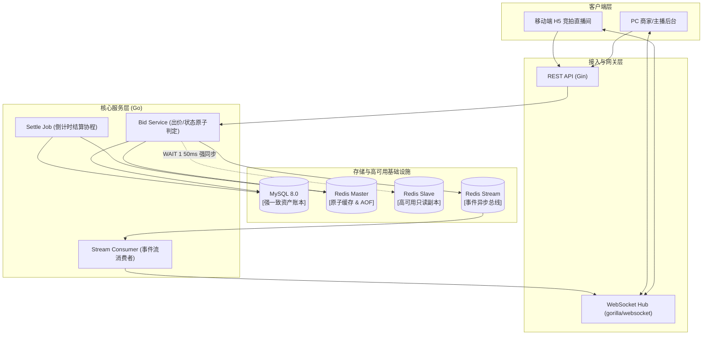
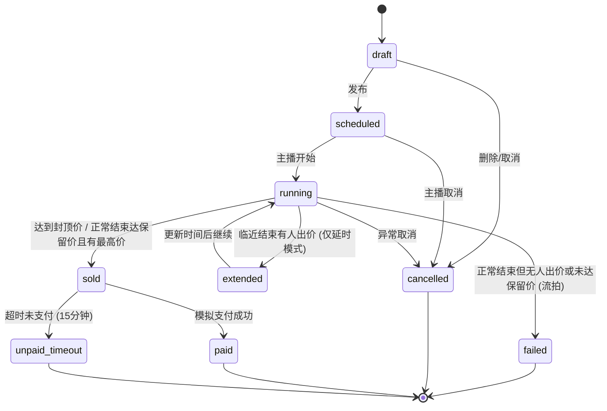
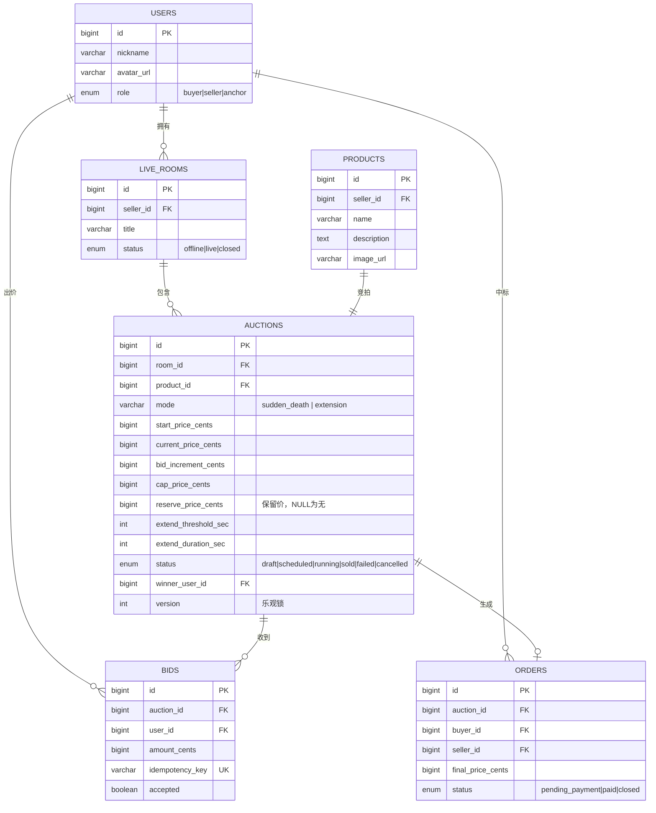
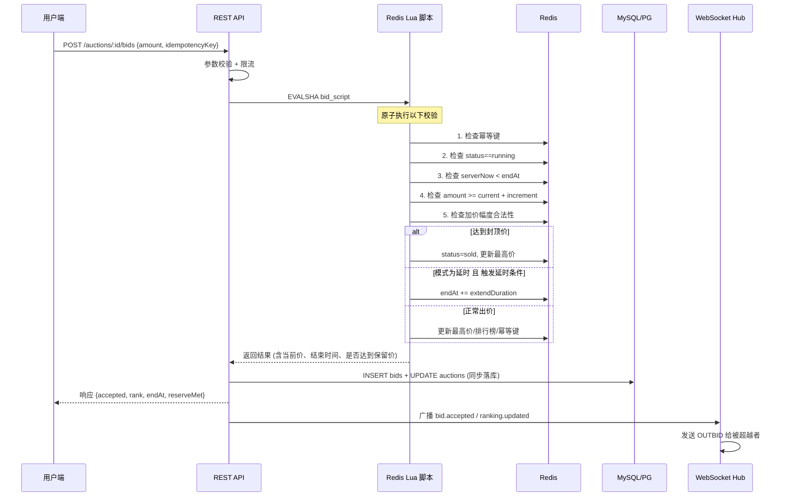
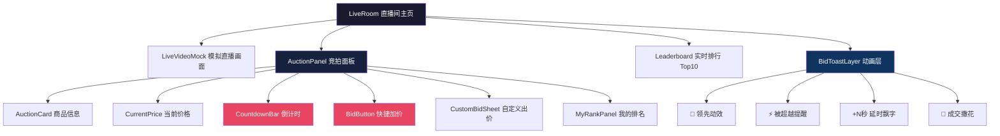
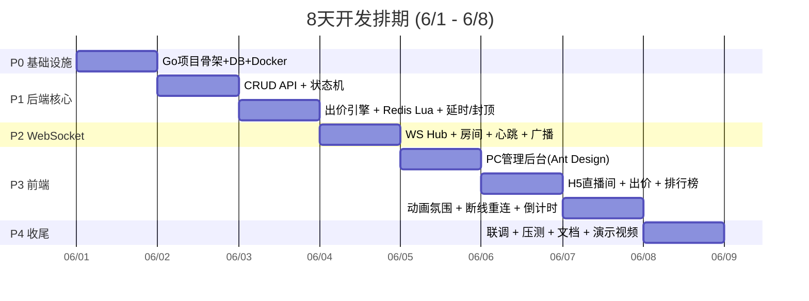

# 「实时竞拍大师」直播竞拍全栈系统可执行方案

## 1. 项目目标

本项目实现一套面向直播电商场景的实时竞拍系统，覆盖「商家发布竞拍」「用户进入直播间」「实时出价」「自动延时」「封顶成交」「异常取消」「生成订单」「结果查看」完整闭环。

核心目标：

- 支持多直播间、多竞拍商品并行运行，房间之间实时消息互不影响。
- 支持 100+ 用户同时出价的基础并发场景，并预留 1000+ 在线用户的架构扩展路径。
- 通过 Redis 原子校验、幂等请求、状态机和数据库落库，保障竞价数据一致。
- 前端提供移动端竞拍氛围和 PC 管理后台，突出实时反馈、倒计时、排行榜和关键提醒。
- 输出完整项目材料，包括代码库、方案文档、高并发压测结果、演示视频脚本和 AI 使用记录。

## 2. 推荐技术栈

### 前端

- React 18 + TypeScript
- Vite
- Zustand：轻量状态管理
- React Router：双端路由
- TanStack Query：REST 数据请求缓存
- WebSocket 原生封装：心跳、重连、房间订阅
- Tailwind CSS 或 CSS Modules：快速构建双端 UI
- Framer Motion：出价动效、倒计时紧张感、领先/被超越反馈

### 后端

后端采用 Go：

- Go 1.22+
- Gin 或 Fiber：REST API 服务框架
- WebSocket：`nhooyr.io/websocket` 或 `github.com/gorilla/websocket`
- GORM 或 sqlc：数据库访问层。若更重视类型安全和性能，优先 sqlc；若更重视开发效率，优先 GORM。
- PostgreSQL 或 MySQL：核心业务数据持久化
- Redis：竞拍热数据、排行榜、分布式锁、幂等记录、房间在线人数
- Asynq：基于 Redis 的异步任务，如竞拍结束结算、订单生成、超时检查
- Zap 或 Zerolog + Prometheus 指标：日志和可观测性
- golang-migrate：数据库迁移

说明：Go 更适合本课题强调的高并发长连接、低资源占用和服务端稳定性。前端仍采用 React + TypeScript，前后端通过 REST API 和 WebSocket 协议解耦。

## 3. 总体架构



## 4. 核心业务流程

### 4.1 竞拍发布与模式配置

系统支持三种核心竞拍模式，商家在创建竞拍时可自由选择：

1. **绝杀机制 (Sudden Death)**：
   - **规则**：倒计时归零即刻结束，绝对不延时。倒计时结束时最高出价者得。
   - **业务场景**：秒杀款、引流款、高频低价标品（如：9.9元美妆小样、19.9元零食大礼包）。
   - **特点**：节奏极快（15-30秒一轮），极易调动直播间紧张气氛，留存和促单效果极佳。
   
2. **拍卖延时 (Auction Extension)**：
   - **规则**：设定延时窗口（如结束前 15 秒）。在此窗口内若有人出价，结束时间自动往后延长固定时间（如 20 秒），直到没有人在窗口内出价为止。
   - **业务场景**：中高客单价非标品（如：二手名表、轻奢珠宝、翡翠原石）。
   - **特点**：保证想买的人有充足时间思考出价，避免最后一秒网络卡顿的遗憾，帮助商家实现商品价值最大化。

3. **保留价拍卖 (Reserve Auction)**：
   - **规则**：商家设置一个隐藏或公开的「最低成交保护价」（保留价）。倒计时结束时，如果当前最高价未达到保留价，则系统自动判定为**「流拍」**，不生成订单。
   - **业务场景**：品牌高端大单品、高客单收藏品（如：限量版联名球鞋、极品帝王绿翡翠、艺术字画）。
   - **特点**：保护商家的成本结构，防止低价流失，给予主播极大的降价促销控场空间（主播可以从0元开始拍，制造巨大噱头，但有底价兜底）。

#### 竞拍发布步骤：
1. 主播在 PC 后台创建商品，填写名称、图片、介绍。
2. 选择**竞拍模式**（绝杀模式 / 延时模式）并配置规则：
   - 起拍价：默认 0 元（分）。
   - 加价幅度：每次出价至少递增额。
   - 竞拍时长：倒计时总长。
   - 封顶价：达到即自动成交（可选）。
   - 保留价：最低成交底价（可选，若不设则为0）。
   - 延时触发窗口 & 延时时长（仅延时模式下可配）。
3. 后端保存竞拍为 `draft` 或 `scheduled`。
4. 主播点击开始，状态切换为 `running`，初始化 Redis 热数据并广播 `auction.started`。

### 4.2 用户出价流程

1. 用户进入直播间，REST 拉取商品、规则、当前价、排行榜快照。
2. 前端建立 WebSocket，订阅 `room:{liveRoomId}` 和 `auction:{auctionId}`。
3. 用户点击出价，前端生成 `idempotencyKey`，调用 `POST /api/auctions/:id/bids`。
4. 后端在 Redis Lua 脚本中完成原子校验：
   - 竞拍状态必须为 `running`。
   - 当前时间必须小于结束时间。
   - 出价金额必须大于当前价，且符合加价幅度。
   - 幂等键未处理过。
   - 如达到封顶价，状态直接进入 `sold`。
   - 如触发延时，更新结束时间。
5. 后端持久化出价记录，更新排行榜，广播 `bid.accepted`、`ranking.updated`、`auction.extended` 或 `auction.sold`。
6. 前端根据广播更新价格、倒计时、排名和氛围反馈。

### 4.3 竞拍结束与结算流程

触发结束有三种方式：

- **正常倒计时结束**：定时任务检查 `endAt <= now`。
- **封顶价成交**：出价请求内同步触发（仅当出价额达到 `cap_price_cents` 时）。
- **主播异常取消**：主播在后台随时点击取消竞拍。

结算判断逻辑（倒计时结束时）：
1. **未达保留价**：如果最高出价低于设定的 `reserve_price_cents`，即使有人出价，系统也将竞拍置为 **`failed` (流拍：未达保留价)**，不生成订单，并向直播间广播流拍消息。
2. **无人出价**：直接置为 **`failed` (流拍：无人出价)**。
3. **正常成交**：最高出价达到或超过保留价（或未设保留价且有出价），状态置为 **`sold` (成交)**，并自动生成支付截止时间为 15 分钟的订单。

## 5. 状态机设计

竞拍状态必须由状态机统一管理，不能在业务代码中随意改状态。



状态迁移约束：

| 当前状态 | 允许操作 / 事件 | 目标状态 | 说明 |
| --- | --- | --- | --- |
| `draft` | 编辑规则、发布、取消 | `scheduled` / `cancelled` | 初始草稿状态 |
| `scheduled` | 编辑规则、开始、取消 | `running` / `cancelled` | 准备状态，已配规则 |
| `running` | 出价、延时、封顶成交、结算结束、异常取消 | `running` / `sold` / `failed` / `cancelled` | 竞拍中，最核心状态 |
| `sold` | 支付、超时未付 | `paid` / `unpaid_timeout` | 已生成订单，等待支付 |
| `failed` | 无 | 终态 | 流拍状态（无人出价或未达保留价） |
| `cancelled` | 查看原因 | 终态 | 主播手动撤销竞拍 |

## 6. 数据库设计

### 6.0 数据库 ER 关系图



### 6.1 users

| 字段 | 类型 | 说明 |
| --- | --- | --- |
| id | bigint / uuid | 用户 ID |
| nickname | varchar | 昵称 |
| avatar_url | varchar | 头像 |
| role | enum | `buyer` / `seller` / `anchor` |
| created_at | datetime | 创建时间 |

### 6.2 live_rooms

| 字段 | 类型 | 说明 |
| --- | --- | --- |
| id | bigint / uuid | 直播间 ID |
| seller_id | bigint / uuid | 商家 ID |
| title | varchar | 直播间标题 |
| cover_url | varchar | 封面 |
| status | enum | `offline` / `live` / `closed` |
| created_at | datetime | 创建时间 |

### 6.3 products

| 字段 | 类型 | 说明 |
| --- | --- | --- |
| id | bigint / uuid | 商品 ID |
| seller_id | bigint / uuid | 商家 ID |
| name | varchar | 商品名 |
| image_url | varchar | 商品图 |
| description | text | 商品介绍 |
| created_at | datetime | 创建时间 |

### 6.4 auctions

| 字段 | 类型 | 说明 |
| --- | --- | --- |
| id | bigint / uuid | 竞拍 ID |
| room_id | bigint / uuid | 直播间 ID |
| product_id | bigint / uuid | 商品 ID |
| mode | varchar | 竞拍模式: `sudden_death` (绝杀) / `extension` (延时) |
| start_price_cents | bigint | 起拍价，单位分，默认 0 |
| current_price_cents | bigint | 当前最高价，单位分 |
| bid_increment_cents | bigint | 加价幅度，单位分 |
| cap_price_cents | bigint | 封顶价，单位分 |
| reserve_price_cents | bigint | 保留底价，单位分，可为 NULL |
| start_at | datetime | 开始时间 |
| end_at | datetime | 结束时间 |
| extend_threshold_sec | int | 结束前多少秒触发延时 (仅延时模式有效) |
| extend_duration_sec | int | 每次延长多少秒 (仅延时模式有效) |
| status | enum | 状态机状态: `draft\|scheduled\|running\|sold\|failed\|cancelled` |
| winner_user_id | bigint / uuid | 成交用户 |
| version | int | 乐观锁版本 |
| cancel_reason | varchar | 取消原因 |
| created_at | datetime | 创建时间 |
| updated_at | datetime | 更新时间 |

索引建议：

- `(room_id, status)`
- `(status, end_at)`
- `(winner_user_id)`

### 6.5 bids

| 字段 | 类型 | 说明 |
| --- | --- | --- |
| id | bigint / uuid | 出价 ID |
| auction_id | bigint / uuid | 竞拍 ID |
| user_id | bigint / uuid | 用户 ID |
| amount_cents | bigint | 出价金额，单位分 |
| idempotency_key | varchar | 幂等键 |
| client_ts | bigint | 客户端出价时间戳 |
| server_ts | bigint | 服务端接收时间戳 |
| accepted | boolean | 是否有效 |
| reject_reason | varchar | 拒绝原因 |

唯一索引：

- `(auction_id, idempotency_key)`
- `(auction_id, user_id, amount_cents)` 可选，用于辅助去重分析。

### 6.6 orders

| 字段 | 类型 | 说明 |
| --- | --- | --- |
| id | bigint / uuid | 订单 ID |
| auction_id | bigint / uuid | 竞拍 ID |
| product_id | bigint / uuid | 商品 ID |
| buyer_id | bigint / uuid | 买家 ID |
| seller_id | bigint / uuid | 商家 ID |
| final_price_cents | bigint | 成交价，单位分 |
| status | enum | `pending_payment` / `paid` / `closed` |
| created_at | datetime | 创建时间 |
| paid_at | datetime | 支付时间 |

金额字段建议统一用整数分存储，Go 代码中使用 `int64`，避免 `float64` 或数据库 `decimal` 在比较和取模时带来精度问题。

## 7. Redis 设计

### 7.1 Key 规划

| Key | 类型 | 说明 | TTL |
| --- | --- | --- | --- |
| `auction:{id}:state` | hash | 状态、当前价、最高出价用户、结束时间 | 竞拍结束后 1 天 |
| `auction:{id}:bids` | zset | 出价排行榜，score 为金额或金额+时间复合值 | 竞拍结束后 1 天 |
| `auction:{id}:idem:{key}` | string | 出价幂等记录 | 10 分钟 |
| `auction:{id}:lock` | string | 分布式锁，兜底用 | 5 秒 |
| `room:{id}:online` | set | 在线用户集合 | 动态维护 |
| `room:{id}:channels` | pubsub | 多实例 WebSocket 广播 | 无 |

### 7.2 出价原子校验策略

高并发出价不能先查 Redis 再写 Redis，否则会出现多个请求同时通过校验。推荐使用 Redis Lua 脚本完成原子操作：



校验步骤：

1. **幂等性检查**：幂等键是否存在，存在则直接返回上次结果。
2. **状态校验**：确保 `status == running` 且 `serverNow < endAt`。
3. **出价金额校验**：`amountCents >= currentPriceCents + bidIncrementCents`。
4. **加价幅度合规校验**：`(amountCents - startPriceCents) % bidIncrementCents == 0`，确保符合步长。
5. **封顶价检查**：如果 `capPriceCents > 0` 且 `amountCents >= capPriceCents`，强制状态迁为 `sold`，且当前价设为 `capPriceCents`，直接成交。
6. **延时机制检查 (仅限 mode == 'extension')**：若不是封顶成交，且 `endAt - serverNow <= extendThresholdSec`，则将结束时间延长：`endAt = endAt + extendDurationSec`。
7. **数据写入**：更新 Redis 中的最高价、当前最高出价用户、最新结束时间、排行榜 ZSET，并写入幂等记录。
8. **保留价状态返回**：返回最新状态，同时标明 `reserveMet = (amountCents >= reservePriceCents)`，用于前端实时展示「已达保留价」提示。

数据库持久化可以在 Redis 原子操作成功后同步写入；如果更追求吞吐，可写入队列异步落库，但需要增加补偿任务。本训练营项目建议先同步落库，逻辑更稳。

## 8. REST API 设计

### 8.1 商家/主播端

| 方法 | 路径 | 说明 |
| --- | --- | --- |
| `POST` | `/api/admin/products` | 创建商品 |
| `GET` | `/api/admin/products` | 商品列表 |
| `POST` | `/api/admin/auctions` | 创建竞拍 |
| `PATCH` | `/api/admin/auctions/:id` | 修改未开始竞拍规则 |
| `POST` | `/api/admin/auctions/:id/start` | 开始竞拍 |
| `POST` | `/api/admin/auctions/:id/cancel` | 异常取消 |
| `GET` | `/api/admin/auctions` | 竞拍列表 |
| `GET` | `/api/admin/orders` | 订单列表 |

### 8.2 用户端

| 方法 | 路径 | 说明 |
| --- | --- | --- |
| `GET` | `/api/rooms/:roomId` | 直播间信息 |
| `GET` | `/api/rooms/:roomId/auctions` | 当前直播间竞拍列表 |
| `GET` | `/api/auctions/:id` | 竞拍详情 |
| `POST` | `/api/auctions/:id/bids` | 出价 |
| `GET` | `/api/auctions/:id/ranking` | 排行榜 |
| `GET` | `/api/me/bids` | 我的历史出价 |
| `GET` | `/api/me/orders` | 我的订单 |
| `POST` | `/api/orders/:id/pay` | 模拟支付 |

### 8.3 出价请求示例

```json
{
  "amountCents": 52000,
  "idempotencyKey": "u_1001_a_2001_1717220000000"
}
```

成功响应：

```json
{
  "accepted": true,
  "auctionId": "2001",
  "currentPriceCents": 52000,
  "rank": 1,
  "endAt": "2026-06-01T11:05:30.000Z",
  "extended": true,
  "sold": false
}
```

失败响应：

```json
{
  "accepted": false,
  "code": "BID_TOO_LOW",
  "message": "当前价为 520.00 元，最低有效出价为 530.00 元"
}
```

## 9. WebSocket 协议设计

### 9.1 客户端发送

| 事件 | 说明 | Payload |
| --- | --- | --- |
| `room.join` | 加入直播间 | `{ "roomId": "1" }` |
| `auction.subscribe` | 订阅竞拍 | `{ "auctionId": "2001" }` |
| `ping` | 心跳 | `{ "ts": 1717220000000 }` |
| `auction.sync` | 断线重连后拉取快照 | `{ "auctionId": "2001", "lastSeq": 1024 }` |

### 9.2 服务端广播

| 事件 | 说明 |
| --- | --- |
| `auction.started` | 竞拍开始 |
| `bid.accepted` | 有效出价 |
| `bid.rejected` | 出价被拒，仅发给本人 |
| `ranking.updated` | 排行榜更新 |
| `auction.extended` | 竞拍自动延时 |
| `auction.sold` | 封顶成交 |
| `auction.cancelled` | 异常取消 |
| `auction.ended` | 正常结束 |
| `order.created` | 订单生成 |
| `system.notice` | 系统提示 |

### 9.3 广播消息示例

```json
{
  "event": "bid.accepted",
  "seq": 1025,
  "auctionId": "2001",
  "roomId": "1",
  "data": {
    "userId": "1001",
    "nickname": "小夏",
    "amountCents": 52000,
    "currentPriceCents": 52000,
    "leaderUserId": "1001",
    "endAt": "2026-06-01T11:05:30.000Z"
  },
  "serverTs": 1717220000123
}
```

### 9.4 前端重连策略

- 心跳间隔：客户端每 15 秒发送 `ping`。
- 超时判断：30 秒无 `pong` 则断开重连。
- 重连退避：1s、2s、5s、10s，最大 10s。
- 重连后：
  1. 重新加入直播间。
  2. 重新订阅当前竞拍。
  3. 调用 `auction.sync` 或 REST 详情接口拉取权威快照。
  4. 用服务端 `serverTs` 校准倒计时。

## 10. 前端页面规划

### 10.1 PC 商家/主播后台

路由建议：

- `/admin/dashboard`：直播间概览、在线人数、进行中竞拍、异常提醒。
- `/admin/products`：商品管理。
- `/admin/auctions`：竞拍管理。
- `/admin/auctions/new`：发布竞拍。
- `/admin/auctions/:id`：竞拍详情、实时出价流、排行榜、取消操作。
- `/admin/orders`：订单管理。

关键组件：

- `AuctionRuleForm`：竞拍规则表单。
- `AuctionStatusBadge`：状态标签。
- `LiveBidFeed`：实时出价流。
- `RankingTable`：排行榜。
- `CancelAuctionDialog`：异常取消确认。
- `RealtimeMetricPanel`：在线人数、出价次数、成交率。

### 10.2 移动端 H5

路由建议：

- `/m/rooms/:roomId`：直播间首页。
- `/m/auctions/:auctionId`：竞拍详情。
- `/m/orders`：我的订单。
- `/m/history`：历史竞拍。

#### H5 直播间组件树



关键组件：

- `LiveVideoMock`：固定视频或直播画面模拟。
- `AuctionCard`：竞拍商品卡片。
- `CountdownBar`：毫秒级倒计时展示。
- `BidButton`：快捷加价按钮。
- `CustomBidSheet`：自定义金额出价面板。
- `MyRankPanel`：我的排名和差距。
- `BidToastLayer`：领先、被超越、延时、结束提示。
- `PaymentMock`：模拟支付。

体验亮点：

- 用户成为第一名时显示「领先」动效。
- 用户被超越时显示「被超越」提醒和差价。
- 结束前 10 秒倒计时颜色和动效增强。
- 触发延时时用明显提示说明「有人出价，竞拍延长 20 秒」。
- 出价按钮做节流，避免连点造成重复请求，但后端仍以幂等为准。
- **保留价状态指示器**：在当前价格旁醒目显示「未达保留价」（红色警示色）或「已达保留价」（绿色安全色，并在达成瞬间触发小彩带动效），激发竞拍者冲过保留线。
- **流拍与结束动效**：当时间归零且未达到保留价时，全屏显示「流拍」氛围特效；若竞拍成功，则弹出「恭喜成交，去支付」的浮窗。

## 11. 后端分层设计

推荐目录结构：

```text
backend/
  cmd/
    api/
      main.go
    worker/
      main.go
  internal/
    config/
    server/
      http.go
      websocket.go
      router.go
    domain/
      auction/
        entity.go
        state_machine.go
        service.go
        repository.go
      bid/
        entity.go
        service.go
        repository.go
      order/
        entity.go
        service.go
        repository.go
      room/
      product/
      user/
    infra/
      db/
      redis/
      queue/
      logger/
      metrics/
    transport/
      http/
        handler/
        middleware/
        dto/
      ws/
        hub.go
        client.go
        events.go
        room.go
    jobs/
      auction_settlement.go
      order_timeout.go
  migrations/
  scripts/
  go.mod
  go.sum
frontend/
  src/
    pages/
    components/
    stores/
    services/
    hooks/
shared/
  openapi/
  websocket-events.md
```

核心服务职责：

- `AuctionService`：竞拍创建、规则修改、开始、取消、状态迁移。
- `BidService`：出价校验、Redis 原子更新、DB 落库、排行榜更新。
- `AuctionSettlementJob`：由 Asynq Worker 执行，扫描到期竞拍，生成订单或标记流拍。
- `OrderService`：订单创建、支付状态流转。
- `WsHub`：连接管理、房间订阅、广播、心跳、重连同步。

Go 工程建议：

- HTTP Handler 只负责参数解析和响应组装，业务规则放在 Service。
- Repository 层封装数据库读写，Redis 读写放在 `infra/redis` 或具体业务 Repository 中。
- WebSocket Hub 用 channel 管理注册、注销、房间广播，避免多个 goroutine 直接竞争共享 map。
- 所有请求入口都传递 `context.Context`，便于超时控制、日志 trace 和优雅关闭。
- 金额统一使用 `int64` 分，时间统一以服务端时间为准。

## 12. 高并发与一致性方案

### 12.1 出价一致性（资产级强一致）

针对竞拍金额和成交状态等核心资产，系统摒弃了单纯依靠 Redis 内存读写的设计，采用**「主从 Redis 同步校验 + WAIT 半同步保障 + 数据库事务乐观锁」**的多重防护机制：

1. **Redis Master 内存预裁决**：
   - 客户端出价请求首先路由至 Redis Master 执行原子 Lua 脚本。
   - Lua 脚本执行防重、过期、起拍价、步长校验。校验通过则在内存中直接更新最高价，占住出价排位，生成临时结果。
2. **`WAIT` 命令半同步复制（高可用防丢数据）**：
   - Master 执行成功后，Go 服务立即向 Redis Master 发送 **`WAIT 1 50`** 指令，阻塞等待至少 1 个 Slave 副本成功同步该出价。
   - 若 50ms 超时未收到同步确认，表明主从网络异常或 Slave 宕机。此时系统记录 Warning 日志进行**可用性降级**（保证出价链路不停机），并带标记录以便后续校验。
   - 这一步确保了哪怕 Redis Master 突发断电宕机，哨兵（Sentinel）切换拉起的新 Master 依然拥有最新确认的出价，彻底避免“内存回滚”和用户出价凭空消失的纠纷。
3. **MySQL 同步事务落库**：
   - 在 Redis 半同步写入成功后，Go 后端启动 MySQL 显式事务：
     * 写入 `bids` 数据：使用 `(auction_id, idempotency_key)` 唯一联合索引，底层数据库层面彻底防重防抖。
     * 更新 `auctions` 表的最高价与中标人：使用 **`version` 乐观锁**（`WHERE id = ? AND version = ?`），如果版本冲突则回滚，避免高并发下多协程相互覆盖。
4. **数据回滚与修正补偿**：
   - 如果 MySQL 写入失败（如死锁、连接池溢出），则进行 MySQL 事务回滚，并同步下发 Redis 内存回滚命令（清除对应的 ZSET 排行及暂存的当前价，恢复至前一出价），确保存储层与缓存层数据的最终一致性。

### 12.2 消息解耦与推送性能（Redis Stream 异步）

对于高频次、大流量的 WebSocket 广播和后端审计日志/数据大屏统计，系统引入 **Redis Stream** 作为高性能消息总线进行**读写解耦**：

1. **写路径极速返回**：
   - 出价同步落库成功后，Gin API 仅将事件（如 `bid.accepted`）推送到 Redis Stream（名为 `auction:events`）。消息写入开销仅数微秒，HTTP 出价线程无需等待 WebSocket 发送完毕即可极速向用户返回 Response，吞吐量极大提升。
2. **异步并发消费**：
   - 后端启动常驻的 Go 消费者协程（Goroutine），采用 `XREADGROUP` 监听事件流。
   - **WebSocket 消费组**：解析出出价事件，定位对应的直播间 `roomId`，通过 Hub 管道并发安全地广播给千人在线的直播间用户，彻底消除了由于个别用户网络阻塞导致全局出价卡顿的“木桶效应”。
   - **分析消费组**：异步提取出价行为，供统计分析大屏展现或记录安全审计日志。

### 12.3 排行榜与倒计时一致性

- **排行榜实时性**：Redis ZSET 作为排行榜的实时读模型（Score 为出价金额），前端只在连接初始化或重连时从 Redis 拉取完整 ZSET，运行期间仅接收 WebSocket 异步广播的增量事件（`ranking.updated`）更新本地视图，减轻服务器带宽。
- **倒计时绝对权威**：服务器的 `end_at` 拥有唯一决策权。每个 WebSocket 数据帧附带当前服务端的 `serverTs`，客户端本地自动计算网络延迟及系统偏差（`offset = serverTs - Date.now()`），利用本地 `requestAnimationFrame` 补间校准倒计时，规避浏览器后台降频和本地时钟不准的硬伤。

### 12.4 限流与防刷防重

- 前端按钮限制防抖（点击出价后置灰 500ms）。
- 接口层针对单用户出价限流：基于 Redis 令牌桶实现 `RateLimit(userId, 3/s)`。
- 对全局单一竞拍限流：令牌桶上限限流，防止瞬间尖峰压垮 MySQL。

## 13. 可观测性与异常兜底

### 13.1 日志

关键日志字段：

- `requestId`
- `auctionId`
- `roomId`
- `userId`
- `amountCents`
- `currentPriceCents`
- `auctionStatus`
- `latencyMs`
- `rejectReason`

### 13.2 指标

建议采集：

- WebSocket 在线连接数。
- 每个房间在线人数。
- 出价接口 QPS。
- 出价成功率和失败原因分布。
- Redis Lua 脚本耗时。
- WebSocket 广播延迟。
- 竞拍结算任务延迟。

### 13.3 异常兜底

- Redis 临时不可用：暂停出价，前端提示系统繁忙，避免错误成交。
- WebSocket 断开：前端自动重连，期间 REST 轮询详情兜底。
- 数据库写入失败：Redis 成功但 DB 失败时写入补偿队列，后台重试落库。
- 结算任务失败：定时扫描 `running` 且 `endAt < now` 的竞拍进行补偿结算。

## 14. 测试计划

### 14.1 单元测试

重点覆盖：

- 加价幅度校验。
- 封顶价成交。
- 自动延时。
- 状态机非法迁移。
- 幂等键重复请求。
- 出价过低、竞拍已结束、竞拍取消等拒绝场景。

### 14.2 集成测试

重点覆盖：

- 创建竞拍到订单生成完整链路。
- WebSocket 加房、广播、断线重连。
- Redis 排行榜和数据库出价记录一致。
- 主播取消竞拍后用户无法继续出价。

### 14.3 并发测试

工具：

- k6：压测 REST 出价接口。
- Artillery：压测 WebSocket 连接和广播。

压测目标：

- 100 用户同时出价，最终最高价唯一且符合加价规则。
- 1000 WebSocket 在线连接，房间广播无明显堆积。
- P95 出价响应小于 300ms。
- 排行榜与数据库最高价一致。

示例压测场景：

1. 创建一个 0 元起拍、10 元加价、封顶 10000 元的竞拍。
2. 100 个虚拟用户在 30 秒内随机出价。
3. 校验最终 `current_price_cents`、最高出价记录、订单金额一致。
4. 检查重复请求不会产生重复有效出价。

## 15. AI 使用方案与材料沉淀

为了匹配评分中的 AI 使用维度，建议把 AI 使用过程作为项目材料的一部分。

### 15.1 AI 使用流程

- 需求拆解：让 AI 辅助将题目拆成模块、接口、表结构、状态机。
- 代码生成：让 AI 生成样板代码、DTO、测试用例、WebSocket hook、表单组件。
- 代码审查：让 AI 审查竞价一致性、状态机边界、异常兜底。
- 压测分析：让 AI 根据 k6/Artillery 输出总结瓶颈和优化建议。
- 文档生成：让 AI 辅助生成 README、演示脚本和技术方案。

### 15.2 人工把控点

不能完全交给 AI 的关键决策：

- 出价原子性方案。
- 状态机边界。
- Redis 与数据库一致性策略。
- 封顶成交和自动延时冲突时的优先级。
- 并发测试验收标准。
- 演示时的主流程和亮点取舍。

### 15.3 AI 贡献率建议

建议记录：

- AI 生成初稿：约 50%-70%。
- 人工修改和架构决策：约 30%-50%。

汇报时强调：AI 用于提升产出效率，核心一致性、并发策略、业务边界由人工审查和压测验证。

## 16. 开发里程碑（8 天紧凑计划）



### Day 1 (6/1)：项目骨架与基础设施

**目标**：项目能跑起来，数据库表建好

- Go module 初始化 + Gin + GORM 接入
- Docker Compose（MySQL + Redis）
- 数据模型定义 + AutoMigrate
- 前端双项目 Vite 初始化
- 基础 CORS 中间件、统一响应格式

**验收**：`go run` 启动无报错，数据库表自动创建

### Day 2 (6/2)：CRUD API + 状态机

**目标**：商品/竞拍/订单 CRUD 完整可用

- 商品 CRUD（创建、列表、详情）
- 竞拍 CRUD（创建、配置规则、列表）
- 竞拍状态机（draft → scheduled → running → sold/cancelled）
- 开始竞拍 / 取消竞拍接口
- 简化登录（JWT token）

**验收**：Postman 可完整测试所有 CRUD 接口

### Day 3 (6/3)：出价引擎 + Redis 原子校验

**目标**：出价核心逻辑完成，并发安全

- Redis 连接 + Key 规划
- Redis Lua 出价原子校验脚本
- 出价 REST 接口（幂等键、加价幅度校验）
- 封顶价自动成交
- 自动延时逻辑
- 竞拍结束定时任务（Asynq 或 goroutine ticker）
- 订单自动生成

**验收**：多终端同时出价，最高价唯一，延时和封顶正确触发

### Day 4 (6/4)：WebSocket 实时同步

**目标**：所有实时推送功能就绪

- gorilla/websocket Hub + Client + Room
- 房间加入/离开/广播
- 出价成功后广播 bid.accepted + ranking.updated
- 被超越通知（OUTBID）
- 倒计时同步（每秒 TIMER_SYNC）
- 心跳保活（15s ping/pong）
- 竞拍开始/延时/结束/取消广播

**验收**：两个浏览器 tab 连接同一房间，出价实时同步

### Day 5 (6/5)：PC 商家管理后台

**目标**：商家端所有管理功能可用

- Ant Design Pro 布局 + 路由
- 商品管理页（创建/列表）
- 竞拍发布页（规则表单配置）
- 竞拍管理页（状态/进度/实时出价流/取消）
- 订单管理页
- WebSocket 接入（实时出价流展示）

**验收**：可在 PC 端完成「创建商品 → 发布竞拍 → 开始 → 查看出价 → 取消」全流程

### Day 6 (6/6)：H5 移动端直播间

**目标**：用户端竞拍核心交互完成

- 移动端布局（直播画面模拟 + 竞拍面板）
- 商品信息 + 当前价格展示
- 快捷出价按钮 + 自定义金额面板
- 实时排行榜 Top10
- 我的排名面板
- useWebSocket hook（连接/重连/消息分发）
- 倒计时组件（服务端时间校准）
- 模拟支付页面

**验收**：H5 端可出价，排行榜实时更新，倒计时准确

### Day 7 (6/7)：氛围动画 + 异常兜底

**目标**：体验打磨，达到演示质量

- Framer Motion 出价动画（领先🎉 / 被超越⚡）
- 倒计时最后 10 秒紧张效果（红色脉冲）
- 延时飘字动画（+20s）
- 成交撒花动画
- 断线重连 + 状态恢复
- 异常兜底（Redis 不可用提示、网络波动处理）
- 出价音效（可选）

**验收**：完整演示流程体验流畅，动画效果到位

### Day 8 (6/8)：联调 + 压测 + 交付

**目标**：项目可提交

- 端到端全流程联调
- k6 压测脚本（100 并发出价）
- 压测报告生成
- README 完善
- 技术方案文档定稿
- 演示视频录制（5-8 分钟）
- AI 使用记录整理

**验收**：所有提交材料齐备，压测通过

## 17. MVP 范围与加分范围

### 必做 MVP

- 商品创建。
- 竞拍规则配置。
- 竞拍开始、取消、结束。
- 用户出价。
- WebSocket 实时价格和排行榜。
- 自动延时。
- 封顶成交。
- 订单生成。
- 移动端竞拍页面。
- PC 管理后台。

### 优先加分项

建议重点打磨三个方向：

1. 出价一致性：Redis Lua、幂等键、状态机、压测证明。
2. 竞拍氛围：倒计时动效、被超越提醒、实时排行榜。
3. 项目材料：演示视频、压测报告、AI 使用复盘。

不建议早期投入过多：

- 真正的支付接入。
- 复杂权限系统。
- 真视频直播推拉流。
- 过度微服务拆分。

## 18. 演示脚本

建议录制 5-8 分钟演示视频：

1. 打开 PC 后台，创建商品「稀世珠宝」。
2. 配置竞拍：0 元起拍、10 元加价、2 分钟时长、1000 元封顶、结束前 15 秒出价自动延时 20 秒。
3. 点击开始竞拍。
4. 打开两个移动端用户窗口进入直播间。
5. 用户 A 出价，价格和排行榜实时变化。
6. 用户 B 加价，用户 A 收到「被超越」提醒。
7. 接近结束时再次出价，展示自动延时。
8. 出价达到封顶价，展示自动成交。
9. 后台订单管理出现成交订单。
10. 展示压测报告：100 并发出价后最高价一致、无重复成交。

## 19. README 建议结构

```text
# 实时竞拍大师

## 项目简介
## 技术栈
## 核心亮点
## 架构图
## 本地启动
## 数据库初始化
## 功能演示
## API 文档
## WebSocket 协议
## 并发一致性设计
## 压测方法与结果
## AI 使用记录
## 项目截图
```

## 20. 最终提交清单

- 代码仓库。
- `README.md`。
- 技术方案文档。
- 数据库 schema。
- API 和 WebSocket 协议说明。
- 压测脚本与压测报告。
- 演示视频。
- 项目截图。
- AI 使用记录。

## 21. 推荐实施顺序

如果时间有限，按以下顺序推进：

1. 先做后端竞拍核心规则。
2. 再做 WebSocket 实时同步。
3. 然后做移动端竞拍体验。
4. 接着补 PC 后台管理能力。
5. 最后做压测、文档和演示材料。

这套顺序能优先保证评分权重最高的工程完整度和技术深度，同时留出时间打磨竞拍氛围与 AI 使用材料。

---

## 11. 产线状态追踪

表中 #1-#4 为 6/2 日内完成，#101-#104 为 6/3 日完成，编号沿用产线报告文件编号。

### ✅ 已完成闭环

| # | 产线名称 | 报告 | 说明 |
|---|---|---|---|
| 1 | `bid-closed-loop` | `001-bid-interval-rule.md` | 出价频率限制 + Lua 脚本原子校验 |
| 2 | `websocket-push` | `002-websocket-push.md` | Redis Stream → WS 实时推送出价事件 |
| 3 | `h5-bidding-ui` | `003-h5-bidding-ui.md` | H5 前端竞拍直播间交互 |
| 4 | `settle-order-pipeline` | `004-settle-order-pipeline.md` | 结算与订单 — 竞拍结束自动结算/生成订单/支付 |
| 101 | `user-auth` | `101-user-auth.md` | JWT 注册/登录/全局鉴权中间件 |
| 102 | `admin-panel` | `102-admin-panel.md` | 多商家管理后台 — 商品/竞拍/直播间/订单管理 |
| 103 | `buyer-orders` | `103-buyer-orders.md` | 买家 H5 订单列表 + 详情 + 模拟支付 |
| 104 | `deployment` | `104-deployment.md` | Docker Compose 部署 + 初始化脚本 + README |

### ⏳ 待启动闭环

| # | 产线名称 | 优先级 | 说明 |
|---|---|---|---|
| 201 | 集成测试套件 | P1 | 基于 Docker Compose 的端到端集成测试（出价→WS→结算→订单全链路） |
| 202 | 氛围动画与体验打磨 | P2 | Framer Motion 动效（出价领先/被超越/延时飘字/成交撒花）、紧张感倒计时、重连恢复 |
| 203 | 高可用 & 压测 | P2 | k6/Artillery 压测脚本、并发场景下出价一致性验证、压测报告 |
| 204 | 订单售后流程 | P3 | 退款、取消订单、申诉 |
| 205 | JWT 统一鉴权到 WebSocket | P3 | WS 连接改用 JWT token 认证，替换 query 参数 userId |
